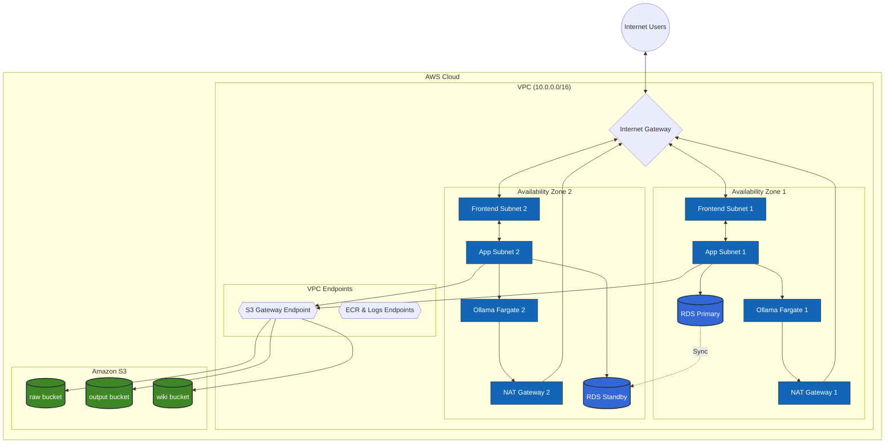

```mermaid
flowchart TB
  %% Styling definitions for a cleaner look
  classDef aws fill:#FF9900,stroke:#232F3E,stroke-width:2px,color:#232F3E;
  classDef vpc fill:#00A4A6,stroke:#232F3E,stroke-width:2px,color:white;
  classDef subnet fill:#1366b5,stroke:#232F3E,stroke-width:1px,color:white;
  classDef s3 fill:#3F8624,stroke:#232F3E,stroke-width:2px,color:white;
  classDef db fill:#3367d6,stroke:#232F3E,stroke-width:2px,color:white;

  Users((Internet Users))

  subgraph AWS ["AWS Cloud"]
    subgraph VPC ["VPC (10.0.0.0/16)"]
      IGW{"Internet Gateway"}
      
      subgraph AZ1 ["Availability Zone 1"]
        NAT1["NAT Gateway 1"]:::subnet
        Front1["Frontend Subnet 1"]:::subnet
        App1["App Subnet 1"]:::subnet
        LLM1["Ollama Fargate 1"]:::subnet
        DB1[("RDS Primary")]:::db
      end
      
      subgraph AZ2 ["Availability Zone 2"]
        NAT2["NAT Gateway 2"]:::subnet
        Front2["Frontend Subnet 2"]:::subnet
        App2["App Subnet 2"]:::subnet
        LLM2["Ollama Fargate 2"]:::subnet
        DB2[("RDS Standby")]:::db
      end
      
      subgraph Endpoints ["VPC Endpoints"]
        S3GW{{"S3 Gateway Endpoint"}}
        ECREP{{"ECR & Logs Endpoints"}}
      end
    end

    subgraph S3 ["Amazon S3"]
      S3Raw[("raw bucket")]:::s3
      S3Out[("output bucket")]:::s3
      S3Wiki[("wiki bucket")]:::s3
    end
  end

  %% External traffic
  Users <--> IGW
  IGW <--> Front1 & Front2

  %% Internal traffic AZ1
  Front1 <--> App1
  App1 --> LLM1 & DB1
  LLM1 --> NAT1
  NAT1 --> IGW

  %% Internal traffic AZ2
  Front2 <--> App2
  App2 --> LLM2 & DB2
  LLM2 --> NAT2
  NAT2 --> IGW

  %% Cross AZ / Endpoints
  DB1 -. Sync .-> DB2
  App1 & App2 --> S3GW
  S3GW --> S3Raw & S3Out & S3Wiki
```